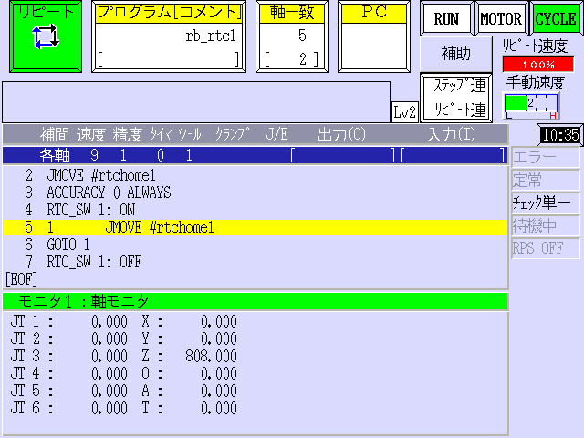
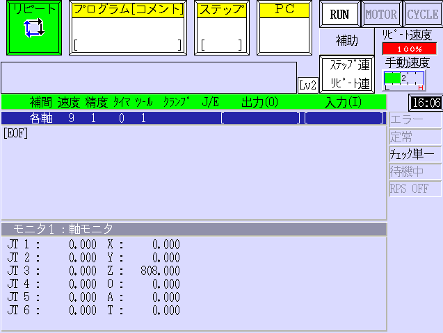
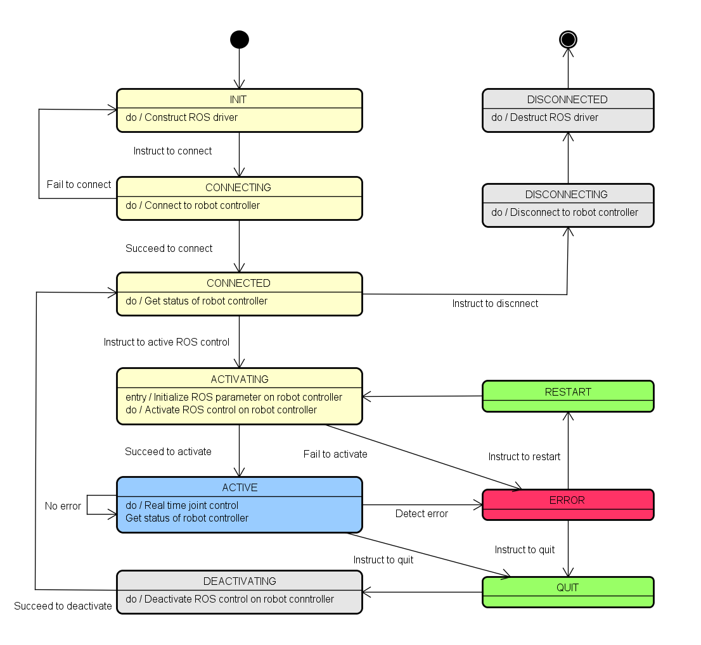

# 実機との接続

## 1. サポートしているASシステム

### Fシリーズ

ハンドリング適用: ```ASF_01000000W``` 以上  
duAro適用: ```ASF_06000000J``` 以上  

### OpenASシリーズ

ハンドリング適用: ```ASE401010XX3S``` 以上  

## 2. 事前準備

### 2-1. ロボットコントローラ

リアルタイム制御を行うため、ロボットコントローラが以下の条件を満たしていることを確認してください。

* コントローラが実機ロボットに接続されており、制御可能な状態であること
* 安全柵の内側に人がいないこと
* コントローラがリピートモードであること
* ティーチペンダントのティーチロックが解除されていること
* ロボットがHOLDではなくRUN状態であること
* エラーが発生していないこと
* コントローラがUbuntu PCとEthernetケーブルで接続され、同一ネットワーク内にいること

### 2-2. Ubuntu PC

リアルタイム制御を行うため、Ubuntu PCが以下の条件を満たしていることを確認してください。

* PCがUbuntu 16.04/18.04でリアルタイムカーネルを使用していること
* 実行ユーザがリアルタイム制御の権限を持っていること
  * (例)リアルタイム制御グループ`realtime`を作成する場合
     1. グループを作成してユーザを追加する

       ```bash
       sudo addgroup realtime
       sudo usermod -aG realtime $(whoami)
       ```

     2. `/etc/security/limits.conf`に以下を記述する  
       (`memlock` は使用するシステムに依存します)

       ```bash
       @realtime - rtprio 99
       @realtime - priority 99
       @realtime - memlock 512000
       ```

## 3. 実機ロボットの操作方法

### 3-1. リアルタイム制御の開始

リアルタイム制御を開始するため、ROSのPCで以下のコマンドを実行してください。  

(例)RS007N:

```bash
roslaunch khi_robot_bringup rs007n_bringup.launch ip:=[Controller’s IP address]
```

リアルタイム制御プロセスが開始すると、以下のメッセージがプロセス上で表示されます。  

```bash
KHI robot control started. [NOT REALTIME]/[REALTIME]
```


メッセージに`[REALTIME]`が含まれる場合、プロセスは`SCHED_FIFO`スケジューリングで動作しているため、問題ありません。

リアルタイム制御プロセスが制御可能状態となると、以下のメッセージがプロセス上で表示されます。

```bash
[KhiRobotKrnxDriver] State 0: ACTIVATING -> ACTIVE
```

メッセージの表示以降は、rvizでの操作インタフェースやpythonのMoveIt! Commanderを使用することで実機ロボットのリアルタイム制御を開始できます。  
リアルタイム制御中は、ティーチペンダントの画面は以下の図のように表示されます。

]

### 3-2. リアルタイム制御の終了

リアルタイム制御を終了するためには、“Ctrl+C”を押してください。  
プロセス終了時に、ロボットコントローラをHold状態に変更します。この時、ティーチペンダントの画面は以下の図のように表示されます。

]

## 4. ドライバ状態

ROS上でロボットコントローラを制御するため、ドライバとして以下の状態を定義しています。



```text
0:  "INIT"            - 初期状態
1:  "CONNECTING"      - ロボットコントローラと接続中
2:  "CONNECTED"       - ロボットコントローラと接続済み。リアルタイム制御は未実行。
3:  "ACTIVATING"      - リアルタイム制御を開始中
4:  "ACTIVE"          - リアルタイム制御中
5:  "HOLDED"          - リアルタイム制御を中断中
6:  "DEACTIVATING"    - リアルタイム制御を停止中
7:  "DISCONNECTING"   - ロボットコントローラから切断中
8:  "DISCONNECTED"    - ロボットコントローラから切断済
9:  "ERROR"           - エラー中
```

これらの状態はコマンドサービス"get_status"から確認することができます。

## 5. コマンドサービス

ROSサービス"khi_robot_command_service"を提供しています。

サービスのフォーマットは以下です。

```text
string type
string cmd
---
int32 driver_ret
int32 as_ret
string cmd_ret
```

コマンドのフォーマットは以下です。

### AS言語の実行

```text
string type -> "as"
string cmd -> AS言語コマンド
---
int32 driver_ret -> ドライバのリターンコード。krnx.hのKRNX_E_***を参照。
int32 as_ret -> ASのリターンコード。ASのマニュアルを参照。
string cmd_ret -> AS言語コマンドの出力
```

### [NUM]の信号状態の取得

```text
string type-> "driver"
string cmd -> "get_signal [NUM]"
---
int32 driver_ret -> ドライバのリターンコード。krnx.hのKRNX_E_***を参照。
int32 as_ret -> ASのリターンコード。ASのマニュアルを参照。
string cmd_ret -> "-1"(ON) or "0"(OFF)
```

[NUM]の範囲 (ASシステムの設定に依ります)

```text
出力: 1~512
入力: 1001~1512
内部信号: 2001~2512
```

### [NUM]の信号状態の指定

```text
string type -> "driver"
string cmd -> "set_signal [NUM], ..."
---
int32 driver_ret -> ドライバのリターンコード。krnx.hのKRNX_E_***を参照。
int32 as_ret -> ASのリターンコード。ASのマニュアルを参照。
string cmd_ret -> 未使用
```

[NUM]の範囲 (ASシステムの設定に依ります)

```text
Output: -1~-512, 1~512
Internal: -2001~-2512, 2001~2512
(正値はON状態を示し、負値はOFF状態を示します)
```

### ドライバ状態の取得

```text
string type -> "driver"
string cmd -> "get_status"
---
int32 driver_ret -> ドライバのリターンコード。krnx.hのKRNX_E_***を参照。
int32 as_ret -> ASのリターンコード。ASのマニュアルを参照。
string cmd_ret -> ドライバ状態
```

### ドライバの中断

```text
string type -> "driver"
string cmd -> "hold"
---
int32 driver_ret -> ドライバのリターンコード。krnx.hのKRNX_E_***を参照。
int32 as_ret -> ASのリターンコード。ASのマニュアルを参照。
string cmd_ret -> 未使用
```

### ACTIVE状態への復帰

```text
string type -> "driver"
string cmd -> "restart"
---
int32 driver_ret -> ドライバのリターンコード。krnx.hのKRNX_E_***を参照。
int32 as_ret -> ASのリターンコード。ASのマニュアルを参照。
string cmd_ret -> 未使用
```

### ドライバの終了

```text
string type -> "driver"
string cmd -> "quit"
---
int32 driver_ret -> ドライバのリターンコード。krnx.hのKRNX_E_***を参照。
int32 as_ret -> ASのリターンコード。ASのマニュアルを参照。
string cmd_ret -> 未使用
```

## 6. エラーとトラブルシューティング

ロボットコントローラ制御中に発生するエラーはすべてROSエラーとしてメッセージ表示します。  
代表的なエラーメッセージとそのトラブルシューティングを以下の表に記載します。  

|エラーメッセージ|トラブルシューティング|
|---|---|
|ROS:%s does not match AS:%s|ROSとロボットコントローラのロボット機種を同じものに合わせてください。|
|Invalid robot size|ロボットのアーム数が正しいか確認してください。|
|Failed to make rtc param|ROSのLinux上のファイルシステムが正常動作しているか確認してください。|
|Failed to load rtc param|ASが正常動作しているか確認してください。|
|Failed to activate: timeout|ASのロボットプログラムが正常動作しているか確認してください。|
|Please change Robot Controller's TEACH/REPEAT to REPEAT|ロボットコントローラのティーチ/リピートモードをリピートモードにしてください。|
|Please change Robot Controller's RUN/HOLD to RUN|ロボットコントローラのRUN/HOLDモードをRUNモードにしてください。|
|Please change Robot Controller's TEACH LOCK to OFF|ロボットコントローラのティーチロックをOFFにしてください。|
|Please change Robot Controller's EMERGENCY to OFF|非常停止をOFFにしてください。|
|AS ERROR [cont_no]: ano:[arm_no] code:[as_error_code]|リアルタイム制御中にエラーが発生しました。<br>ロボットコントローラの"as_error_code "を確認し、[AS言語解説書]に従ってエラーを解消してください。|
|RTC SWITCH turned OFF [cont_no]: ano:[arm_no]|ロボットコントローラのリアルタイム制御がOFFになりました。リアルタイム制御を再開するためには"restart"で制御を再開する必要があります。|
|[krnx_api] returned -[krnx_error_code]|KRNXの%sのAPIがエラーコード-0x%Xを出力しています。KRNXのAPIのエラーコードを参照し、エラーを解消してください。|

エラーが"krnx_PrimeRtcCompData"に関するものである場合は、詳細情報が以下のように表示されます:  
`[KhiRobotKrnxDriver] [krnx_PrimeRtcCompData] ano:[arm_no] [jt]pos:vel:status [JT1]%.4f:%.4f:%d ~ [JT6]%.4f:%.4f:%d`

|Name|Value|Description|
|---|---|---|
|pos|float|各軸指令位置 [rad or m]|
|vel|float|各軸指令速度 [rad/s or m/s]|
|status|0x0001|各軸指令位置が上限値を超えています|
||0x0002|各軸指令位置が下限値を超えています|
||0x0004|RTCの各軸指令速度が(位置差分)が制限値を超えています|

KRNXのAPIのエラーコードは“khi_robot/khi_robot_control/include/krnx.h”で定義されています。エラーコードの詳細と値を以下の表で記載します。

|マクロ定義|詳細|値|
|---|---|---|
|KRNX_NOERROR|エラーなし|(0x0000)|
|KRNX_E_BADARGS|引数異常|(-0x1000)|
|KRNX_E_INTERNAL|内部エラー|(-0x1001)|
|KRNX_E_NOTSUPPORTED|サポート外のAPI|(-0x1002)|
|KRNX_E_TIMEOUT|タイムアウト|(-0x1003)|
|KRNX_E_AUXNOTREADY|外部モニタ未稼働|(-0x1004)|
|KRNX_E_FOPENFAIL|ファイルオープン失敗|(-0x1005)|
|KRNX_E_FILENOTREADY|ファイルが存在しない|(-0x1006)|
|KRNX_E_MATRIX|行列演算エラー|(-0x1007)|
|KRNX_E_OUTOFRANGE|逆変換エラー|(-0x1008)|
|KRNX_E_CANNOTCAL|逆ヤコビ計算不可|(-0x1009)|
|KRNX_E_COMPDATA|RTC補正値エラー|(-0x100a)|
|KRNX_E_BADUSERID|不正なユーザID|(-0x100c)|
|KRNX_E_NULLRESP|データ未受信|(-0x100d)|
|KRNX_E_LOSTPROMPT|プロンプト受信タイムアウト|(-0x100e)|
|KRNX_E_BUFSND|汎用通信送信エラー|(-0x1010)|
|KRNX_E_BUFRCV|汎用通信受信エラー|(-0x1011)|
|KRNX_E_BUFTMO|汎用通信タイムアウト|(-0x1012)|
|KRNX_E_ASERROR|AS側でエラー発生|(-0x1020)|
|KRNX_E_NOROBOT|ロボット機種未選択|(-0x1021)|
|KRNX_E_SOCK|ソケット作成エラー|(-0x2000)|
|KRNX_E_NOHOST|不正なホスト名|(-0x2001)|
|KRNX_E_IOCTLSOCK|ソケット設定エラー|(-0x2002)|
|KRNX_E_SOCKWRITE|ソケット書込エラー|(-0x2003)|
|KRNX_E_SOCKREAD|ソケット読込エラー|(-0x2004)|
|KRNX_E_NODATA|ソケットデータなし|(-0x2005)|
|KRNX_E_INVALIDPORT|不正なポート番号|(-0x2006)|
|KRNX_E_CONNECT|ソケット接続失敗|(-0x2007)|
|KRNX_E_CANTLOGIN|ログイン失敗|(-0x2008)|
|KRNX_E_ALREADYOPENED|ソケット接続済み|(-0x2009)|
|KRNX_E_UNEXPECTED|受信データ異常|(-0x2010)|
|KRNX_E_KINENOTREADY|キネマティクス未初期化|(-0x2011)|
|KRNX_E_ASDELAYED|通信同期エラー|(-0x2012)|
|KRNX_E_BUFEMPTY|汎用通信バッファエラー|(-0x2013)
|KRNX_E_BUFNO|バッファ番号が不適当|(-0x2014)
|KRNX_E_BUFDATANUM|送信データ数が不適当|(-0x2015)
|KRNX_E_RT_INTERNAL|RT通信内部エラー|(-0x2100)
|KRNX_E_RT_CONNECT|RT通信接続エラー|(-0x2101)|
|KRNX_E_RT_TIMEOUT|RT通信タイムアウト|(-0x2102)|
|KRNX_E_RT_NOTCONNECT|RT通信未接続|(-0x2103)|
|KRNX_E_RT_SEND|RT通信送信エラー|(-0x2104)|
|KRNX_E_PCASALREADYRUNNING|PC-AS二重起動|(-0x2200)|
|KRNX_E_TOOMANYPROC|プロセス数超過|(-0x2201)|
|KRNX_E_INVALIDFILENAME|不正なファイル名|(-0x2202)|
|KRNX_E_ILLCONTNO|不正なコントローラ番号|(-0x2203)|
|KRNX_E_UNDEFF|未定義エラー|(-0xFFFF)|

## 7. 注意事項

* Ubuntu 16.04/18.04のリアルタイムカーネルを使用してください。
* リアルタイム制御中、ロボットコントローラはリピートモードと同じ状態です。そのため、リアルタイム制御中は周囲の安全に注意してください。
* "khi_robot"パッケージに変更は加えないでください。
* 動作計画や指令値生成方法の詳細については、MoveIt!のドキュメントやコミュニティを参照してください。