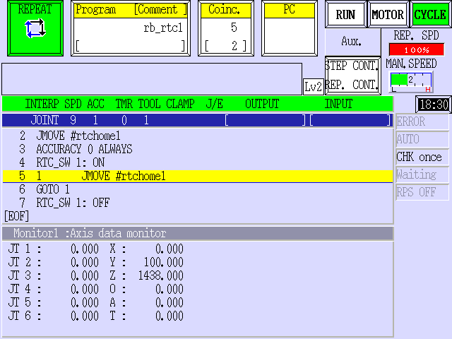
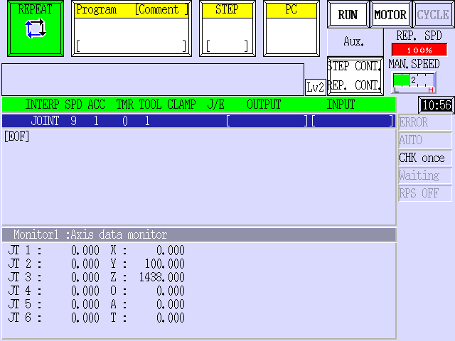

# 1. Supported AS system

## F Series

Handling: Higher than ASF_01000000W

## OpenAS Series

Handling: Higher than ASE401010XX3S

# 2. How to operate on real robot 

## 2-1. Preparation

Make sure that the robot controller used for real-time control satisfies the following conditions.

* The controller is connected with a robot and ready to operate.
* Nobody is inside the safety fence. 
* The controller is in [REPEAT] mode. 
* TEACH LOCK on the Teach pendant is switched to OFF.
* Robot is not on Hold status.
* No error.
* The controller is connected to an Ubuntu PC with Ethernet cable and both are within the same network subnet.

## 2-2. Start real-time control

Execute the following command on the ROS running PC to start the real-time control at an administrate level of root.  

(e.g.)RS007N:
```
roslaunch khi_robot_bringup rs007n_bringup.launch ip:=[Controller’s IP address]
```

When the real-time control process is started, all axes of the robot moves to 0 positions. (Figure 4)

When the real-time control process is ready to go, the following messages will be displayed by the process.
```
[KhiRobotKrnxDriver] State 0: ACTIVATING -> ACTIVE
```

Once the above messages is confirmed, you are able to start real-time control of the robot from the operation interface of “rviz” or the python’s MoveIt! Commander. 
During the real-time control, the display on the Teach pendant will show the figure below.

]

## 2-3. Terminate the real-time control

Press “Ctrl+C” to end the real-time control. 
Ending process stops the robot controller and turns it to HOLD state. The display on the Teach pendant will show the figure below.

]

# 3. Driver State

To control robot controller on ROS, the drivere has control states.


```
0:  "INIT"            - Driver init state.
1:  "CONNECTING"      - Driver is now connecting to Robot Controller.
2:  "CONNECTED"       - Driver is connected to Robot Controller, but cannot control Robot Arm.
3:  "ACTIVATING"      - Driver is now activating Robot Arm.
4:  "ACTIVE"          - Driver can control Robot Arm.
5:  "DEACTIVATING"    - Driver is now deactivating Robot Arm.
6:  "DISCONNECTING"   - Driver is now disconnecting to Robot Controller.
7:  "DISCONNECTED"    - Driver is disconnected to Robot Controller.
8:  "ERROR"           - Driver halted due to ERROR.
9:  "RESTART"         - Driver accepts restart instruction.
10: "QUIT"            - Driver accepts quit instruction.
```

You can get this status by Command Service "get_status".


# 4. Command Service

Service "khi_robot_command_service" is available.

Service format is below...
```
string type
string cmd
---
int32 driver_ret
int32 as_ret
string cmd_ret
```

Command format is below...

## Execute AS Language Command
```
string type -> "as"
string cmd -> AS Language Command
---
int32 driver_ret -> driver's return code. Refer KRNX_E_*** in krnx.h
int32 as_ret -> AS return code. Refer AS manual.
string cmd_ret -> Response of AS Language Command
```

## Get Signal Status of [NUM]
```
string type-> "driver"
string cmd -> "get_signal [NUM]"
---
int32 driver_ret -> driver's return code. Refer KRNX_E_*** in krnx.h
int32 as_ret -> AS return code. Refer AS manual.
string cmd_ret -> "-1"(ON) or "0"(OFF)
```
[NUM] range (depended on AS system setting)
```
Output: 1~512
Input: 1001~1512
Internal: 2001~2512
```

## Set Output Signal Status of [NUM]
```
string type -> "driver"
string cmd -> "set_signal [NUM], ..."
---
int32 driver_ret -> driver's return code. Refer KRNX_E_*** in krnx.h
int32 as_ret -> AS return code. Refer AS manual.
string cmd_ret -> NOT USED
```
[NUM] range (depended on AS system setting)
```
Output: -1~-512, 1~512
Internal: -2001~-2512, 2001~2512
(Positive value indicates ON state, and negative value does OFF state.)
```

## Get Driver Status
```
string type -> "driver"
string cmd -> "get_status"
---
int32 driver_ret -> driver's return code. Refer KRNX_E_*** in krnx.h
int32 as_ret -> AS return code. Refer AS manual.
string cmd_ret -> Driver Status
```

## Restart Driver when its status is ERROR
```
string type -> "driver"
string cmd -> "restart"
---
int32 driver_ret -> driver's return code. Refer KRNX_E_*** in krnx.h
int32 as_ret -> AS return code. Refer AS manual.
string cmd_ret -> NOT USED
```

## Quit Driver
```
string type -> "driver"
string cmd -> "quit"
---
int32 driver_ret -> driver's return code. Refer KRNX_E_*** in krnx.h
int32 as_ret -> AS return code. Refer AS manual.
string cmd_ret -> NOT USED
```

# 5. Error and Troubleshooting

All of the errors happened during ROS control process will be sent as a message in Error level.
Frequent error messages and troubleshooting are as shown in the table below. 

|Error message|Troubleshooting|
|---|---|
|ROS:%s does not match AS:%s|Match the robot model on ROS and robot controller.|
|Please change Robot Controller's TEACH/REPEAT to REPEAT|Switch the TEACH/REPEAT mode of the robot controller to REPEAT.|
|Please change Robot Controller's RUN/HOLD to RUN|Switch the RUN/HOLD of the robot controller to RUN.|
|Please change Robot Controller's TEACH LOCK to OFF|Set the TEACH LOCK on the robot controller to OFF.|
|Please change Robot Controller's EMERGENCY to OFF|Release the EMERGENCY button.|
|ERROR [cont_no]: rno:[robot_no] code:[as_error_code]|Error occurred during the real-time control.<br>Check the error code “as_error_code” of the robot controller and release the error by refering to the [AS Language Reference Manual].|
|RTC terminated %d: rno:%d|Real-time control of the robot controller is terminated. Restart the “khi_robot_control”.|
|[KhiKrnxDriver] %s returned -0x%X|API %s of KRNX returned the error code -0x%X. Refer to the error code of the KRNX API and release the error.|


Error code of KRNX API is defined in “khi_robot/khi_robot_control/include/khi_robot_control/krnx.h”. Description and Value of the error codes are shown in the table below. (Table 2)

|Macro Definition|Description|Value|
|---|---|---|
|KRNX_NOERROR|No Error|(0x0000)|
|KRNX_E_BADARGS|Invalid Argument|(-0x1000)|
|KRNX_E_INTERNAL|Internal Error|(-0x1001)|
|KRNX_E_NOTSUPPORTED|Not Supported API |(-0x1002)|
|KRNX_E_TIMEOUT|Timeout|(-0x1003)|
|KRNX_E_AUXNOTREADY|AUX Monitor Not Ready|(-0x1004)|
|KRNX_E_FOPENFAIL|File Open Fail|(-0x1005)|
|KRNX_E_FILENOTREADY|File Not Exist|(-0x1006)|
|KRNX_E_MATRIX|Matrix Calculation Error|(-0x1007)|
|KRNX_E_OUTOFRANGE|Inverse Conversion Error|(-0x1008)|
|KRNX_E_CANNOTCAL|Inverse Jacobian Error|(-0x1009)|
|KRNX_E_COMPDATA|RTC Error|(-0x100a)|
|KRNX_E_BADUSERID|Bad User ID|(-0x100c)|
|KRNX_E_NULLRESP|Data Not Received|(-0x100d)|
|KRNX_E_LOSTPROMPT|Timeout for Prompt Receive|(-0x100e)|
|KRNX_E_BUFSND|Communication Send Error|(-0x1010)|
|KRNX_E_BUFRCV|Communication Receive Error|(-0x1011)|
|KRNX_E_BUFTMO|Communication Timeout|(-0x1012)|
|KRNX_E_ASERROR|AS Error|(-0x1020)|
|KRNX_E_NOROBOT|No Robot Setting|(-0x1021)|
|KRNX_E_SOCK|Socket Create Error|(-0x2000)|
|KRNX_E_NOHOST|Bad Hostname|(-0x2001)|
|KRNX_E_IOCTLSOCK|Socket Setting Error|(-0x2002)|
|KRNX_E_SOCKWRITE|Socket Write Error|(-0x2003)|
|KRNX_E_SOCKREAD|Socket Read Error|(-0x2004)|
|KRNX_E_NODATA|No Socket Data|(-0x2005)|
|KRNX_E_INVALIDPORT|Invalid Port Number|(-0x2006)|
|KRNX_E_CONNECT|Socket Connect Fail|(-0x2007)|
|KRNX_E_CANTLOGIN|Login Fail|(-0x2008)|
|KRNX_E_ALREADYOPENED|Socket Already Used|(-0x2009)|
|KRNX_E_UNEXPECTED|Received Data Error|(-0x2010)|
|KRNX_E_KINENOTREADY|Kinematics Not Initialized|(-0x2011)|
|KRNX_E_ASDELAYED|Communication Sync Error|(-0x2012)|
|KRNX_E_BUFEMPTY|Communication Buffer Error|(-0x2013)
|KRNX_E_BUFNO|Invalid Buffer Number|(-0x2014)
|KRNX_E_BUFDATANUM|Send Data Error|(-0x2015)
|KRNX_E_RT_INTERNAL|RT Communication Internal Error|(-0x2100)
|KRNX_E_RT_CONNECT|RT Communication Connect Error|(-0x2101)|
|KRNX_E_RT_TIMEOUT|RT Communication Timeout|(-0x2102)|
|KRNX_E_RT_NOTCONNECT|RT Communication Connect Error|(-0x2103)|
|KRNX_E_RT_SEND|RT Communication Send Error|(-0x2104)|
|KRNX_E_PCASALREADYRUNNING|PC-AS Already Running|(-0x2200)|
|KRNX_E_TOOMANYPROC|Too Many Process|(-0x2201)|
|KRNX_E_INVALIDFILENAME|Invalid File Name|(-0x2202)|
|KRNX_E_ILLCONTNO|Invalid Controller Number|(-0x2203)|
|KRNX_E_UNDEFF|Undefined Error|(-0xFFFF)|

# 6. Precausions

* Make sure to use realtime kernel for Ubuntu 16.04.
* When a robot controller is in the real-time control mode, its state is same as the REPEAT mode. Therefore make sure to the safety issues when the robot controller is in real-time control mode.    
* Never make any changes on the sources of the “khi_robot” package.
* Refer to the Documents and community of the MoveIt! for more details on motion/path planning and how to calculate command value.   